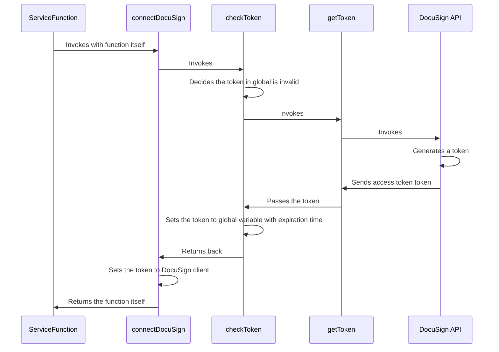

# Your GitHub Learning Lab Repository for Introducing GitHub

Welcome to **your** repository for your GitHub Learning Lab course. This repository will be used during the different activities that I will be guiding you through. See a word you don't understand? We've included an emoji 📖 next to some key terms. Click on it to see its definition.

Oh! I haven't introduced myself...

I'm the GitHub Learning Lab bot and I'm here to help guide you in your journey to learn and master the various topics covered in this course. I will be using Issue and Pull Request comments to communicate with you. In fact, I already added an issue for you to check out.

I'll meet you over there, can't wait to get started!

This course is using the :sparkles: open source project [reveal.js](https://github.com/hakimel/reveal.js/). In some cases we’ve made changes to the history so it would behave during class, so head to the original project repo to learn more about the cool people behind this project.

